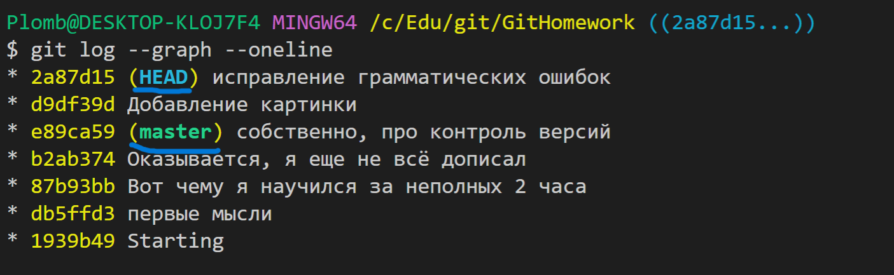
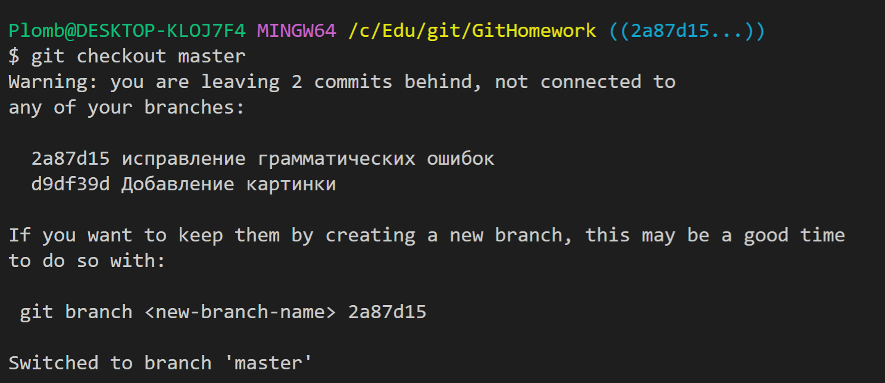
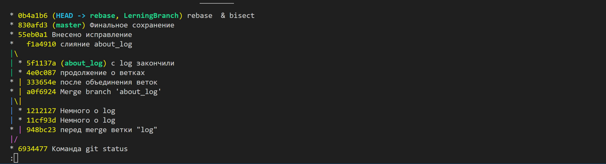

# Семинар по Git

## Git Tutorial

### Начало
=================================================
* Создаем папку (для каждого нового проекта создается отдельная папка!!!)
* **git init** - создаем скрытую папку с отслеживанием изменений
* Редактируем файл
* Сохраняем файл
* Добавляем изменения в Git посредством команды **git add** file
* Сохраняем изменения в Git и оставляем комментарий **git commit** -m'комментарий'.
* *git status* - отображение статуса git

## Контроль версий

* git log - отображение всех доступных *коммитов*
* git checkout №коммита - переход к конкретному коммиту.
* возвращение к последней версии - git checkout master

### Для удобства отображения *log*, используются некоторые дополнительные команды **(--command)**
* *--5* - вывод последних 5 значений.
* *--graph* -графическое отображение взаимосвязи веток.
* *--oneline* - удобный вывод инфqqормации о коммита одной строкой.
* *--stat* - отображает сокращенную статистику для каждого коммита.
* *-p или --patch* - показывает разницу между внесенными коммитами.

## Работа с ветками
*git branch* - выводит все доступные ветки. 
*git branch __branchname__* - переход к ветке __branchname__
* Важное замечание: никогда не использовать *git branch HEAD* ! В данном случае произойдет отрыв головы от ветки, что приведет к недоступности комита при переходе в ветку:
 Таким образом, при переходе в ветку master, Git создаст предупреждение о том ,что коммиты после отрыва Head от ветки, могут быть потеряны, если не будет **создана ветка с указанием последнего оторванного коммита**:

В итоге, потребность использования _merge_ возникла раньше, чем я начал заполнять .md файл.

*git merge* - команда для слияния веток. Перед применением команды необходимо убедиться, что мы находимся в основной ветке(master), либо в ветке, с которой мы желаем слить указываемую ветку.

# Список команд:
* *git status* - отображение статуса git
* *git --version* - проверка версии
* *git init* - инициализация git в конкретной папке
* *git add file* - добавление сохраненной версии файла в Git
* *git commit* - создание комментария (-m'_______')
* *git log* - отображает все доступные *коммиты*.

Команды с LerningBranch (в дальнейшем ,каждая новая команда будет создаваться в отдельной ветке с созданием описания этой команды): 
* *git rebase 'branchname'* - команда представляет возможность скопировать набор коммитов, и перенести их в другое место. Преимущество *rebase* над *merge*, на данный момент - не понятно. На данный момент, имеем следующий лог: 

После ребазирования ветки rebase в ветку LerningBranch найти отличие merge от rebase, на данном этапе- не удалось. Возможно, это связано с тем, что в ветке *LerningBranch* не было создано новых коммитов после создания ветке *rebase*